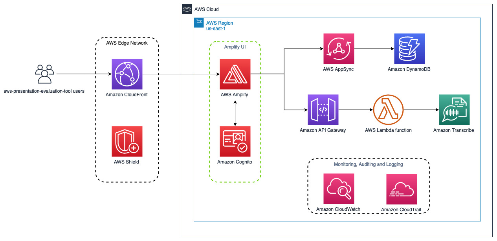

<h1 align="center">
  <br>
  aws-presentation-evaluation-tool
  <br>
</h1>

<!--BEGIN STABILITY BANNER-->

<h4 align="center">A web application built on AWS that coaches users to create a successful presentation</a>.</h4>

<p align="center">
  <a href="#overview">Overview</a> •
  <a href="#setup">Setup</a> •
  <a href="#build">Build</a> •
  <a href="#deploy">Deploy</a> •
  <a href="#cleanup">Cleanup</a> •
</p>


> **This is an experimental example. It may not build out of the box**
>
> This examples is built on an Amplify project marked "Experimental" and may not be updated for latest breaking changes.
>
> It additionally requires infrastructure prerequisites that must be created before successful build.
>
> If build is unsuccessful, please create an [issue](https://github.com/aws-samples/aws-cdk-examples/issues/new) so that we may debug the problem 

---
<!--END STABILITY BANNER-->

## Overview

Public speaking skills are fundamental for professional development, regardless of industry. Dry-runs and feedback are vital to improve communication and build leadership skills. It can be difficult to get quantifiable, unbiased and actionable insights when dry-running alone. ​While rehearsing in front of others can offer valuable feedback, finding a human audience can be intimidating, time-consuming and may not always be feasible. 

aws-presentation-evaluation-tool is a scalable solution that integrates ML services with video streaming in order to extract insights that define a successful presentation (i.e. words-per-minutes, eye contact, filler words, weasel words, and more.). Using services such as Transcribe, Comprehend and models such as [PoseNet](https://github.com/tensorflow/tfjs-models/tree/master/posenet), aws-presentation-evaluation-tool analyzes presenters and generates instant reports that provides insights into user presentations, as well as real-time prompts on areas to improve.



Before deploying this application, you will need to install the [Amplify CLI](https://docs.amplify.aws/cli/start/install/) and the [AWS Cloud Development Kit (CDK)](https://docs.aws.amazon.com/cdk/v2/guide/getting_started.html).


## Setup
Clone the repo:

```bash
git clone https://github.com/aws-samples/aws-presentation-evaluation-tool.git .
```

Change the bucket name in `amplify/backend/hosting/S3AndCloudFront/parameters.json` from `<S3-BUCKET-NAME>` to a name of your choosing according to the [S3 bucket naming rules](https://docs.aws.amazon.com/AmazonS3/latest/userguide/bucketnamingrules.html).

## Build

To build this app, you need to be in this project's root folder. Then run the following:

```bash
cd aws-presentation-evaluation-tool
npm install --legacy-peer-deps
amplify init
```

This will install the necessary JavaScript packages and bootstrap the Amplify environment for deployment.

## Deploy

Run `amplify publish`. This will deploy / redeploy your Amplify to your AWS Account.

After the deployment you will see the Amplify URL, which represents the url hosting the web app.

Happy presenting :)

## Cleanup

1. Run `amplify delete`. This will delete Amplify-deployed resources from your AWS Account.

2. Confirm that the S3 bucket from the `Setup` step and Amplify deployment (`amplify-projectname-envname-12345-deployment`) bucket has been emptied and deleted in the [S3 console](https://s3.console.aws.amazon.com/s3/home?region=us-east-1).

3. Delete the `WellPresentedSTS` IAM role and `useTranscribeComprehend` IAM policy in the [IAM console](https://us-east-1.console.aws.amazon.com/iam/home#/home).

4. Empty the log groups associated with the Amplify project. Their names will be formatted as `/aws/lambda/amplify-proejctname-LogGroup-abcde1234`.
